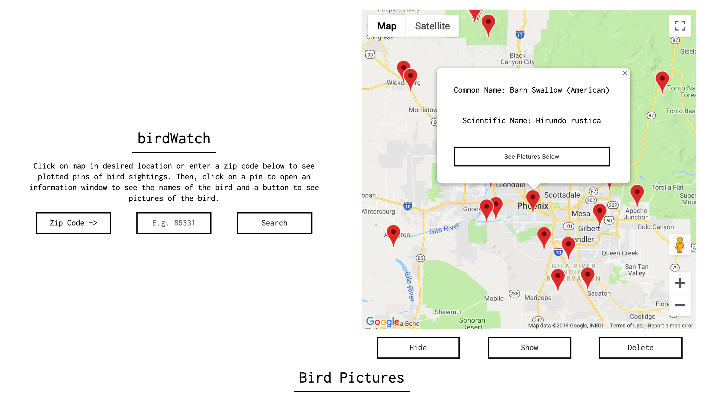
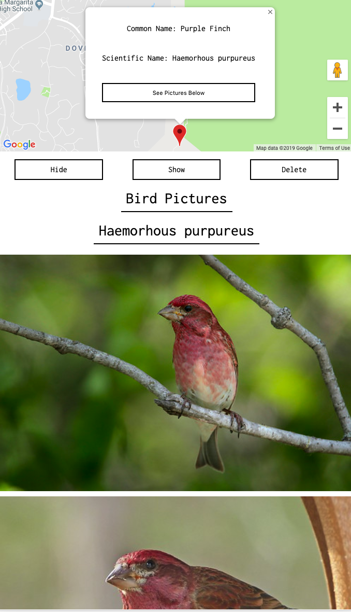

# birdWatch
------------

[birdWatch Website](https://philliprousu.github.io/birdWatch/)
[birdWatch Repo](https://github.com/philliprousu/birdWatch)

##Summary
------------

birdWatch lets users click on the map in a desired location to see notable bird sightings near their click. They can also enter a zip code for the same effect. Then they can click on one of these plotted pins to open an information window with the common/scientific names of the bird, plus a button that they can click to have pictures populate below. 

###Technology
------------
The app uses Googles Geocode and Maps API, Cornell University's eBird API, and flickr.coms API. HTML/CSS/JS/JQuery. 

####ScreenShots

